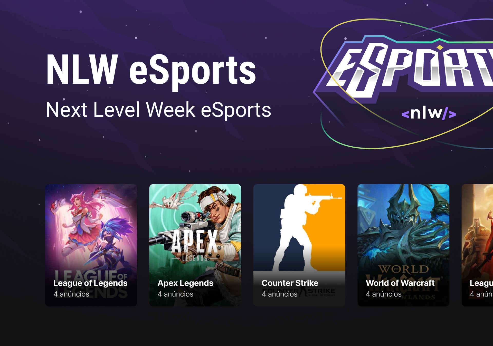

<h1 align="center">
  
</h1>

  
  
  

<h1 align="center">
  
</h1>

## 💻 Projeto

Esse projeto é dedicado ao universo de games

## 🧪 Tecnologias

Esse projeto foi desenvolvido com as seguintes tecnologias

- [Node.js](https://nodejs.org/en/)
- [React](https://pt-br.reactjs.org/)
- [React Native](https://reactnative.dev/)
- [Expo](https://expo.dev/)
- [TypeScript](https://www.typescriptlang.org/)
- [Prisma](https://www.prisma.io/)
- [Vite](https://vitejs.dev/)
- [TailwindCSS](https://tailwindcss.com/)

## 🚀 Como executar

- Clone o repositório
- Instale as dependências com `yarn` ou `npm install`
- Rode o projeto
  - Back-end: `yarn dev` ou `npm run dev`
  - Front-end: `yarn dev` ou `npm run dev`
  - Mobile: `yarn start` ou `npm start` ou `expo start`

---

Feito com 💜 by Pedro Duarte 👋🏻
